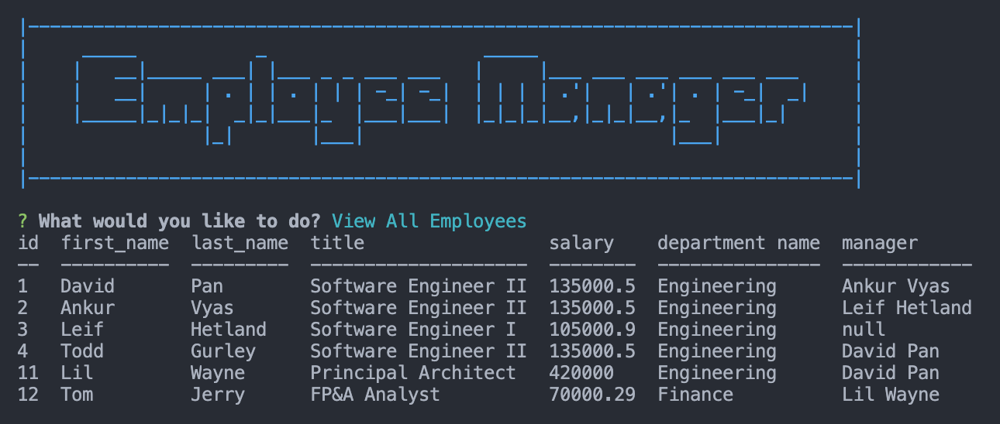

# Employee Tracker · [](https://opensource.org/licenses/MIT)

  ## Description

  Employee Tracker is a command-line application that helps employers, particularly non-developers, to easily view and interact with employee information stored in a database, without the need of writing any SQL queries. The application leverages the `inquirer` and `MySQL` packages.

  
  
  ## Table of Contents
  
  * [Installation](#installation)
  * [Usage](#usage)
  * [Contributing](#contributing)
  * [License](#license)
  * [Questions](#questions)
  
  
  ## Installation
  
  Before using the application, run the following to install the required dependencies:
```
npm install
```
  
  Seed the database using the schemas provided.
  
  ## Usage 
  
  After installing the required dependencies, initialize the application within the command-line interface by running:
```
node employeeTracker.js
```

A prompt will appear, allowing a user to execute CRUD operations. 

[Video Demo](https://drive.google.com/file/d/1WCqJErY_lnjO7S0M1dufGi8g9LTFfmno/view?usp=sharing)
  
  ## Contributing
    
  Open to any and all contributions. Please ensure your pull requests adhere to the following guidelines:
  - Keep descriptions short and simple, but descriptive
  - Check your spelling and grammar

  ## License
  
  Employee Tracker is [MIT licensed](https://opensource.org/licenses/MIT).

  ## Questions
  
  If you have additional questions, you can reach me at: dpan5425@gmail.com
